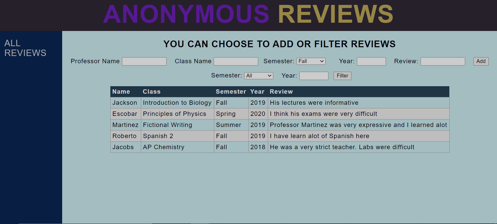
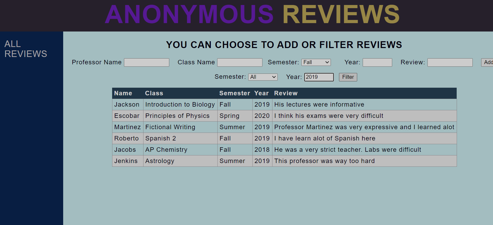
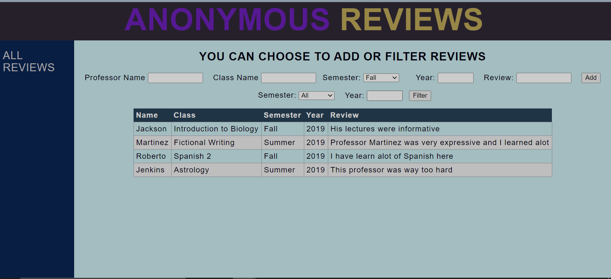

Anonymous-Thoughts

This is a site where users can write anonymous reviews on a Professor or a Course that they have taken. They can also filter all the reviews in the website by years and semester so the user can find a specific review easier.

Motivation

This project was motivated by a desire to practice fundamental web-development skills and turning into a very user-friendly site! This was particularly aimed at practicing using Express' framework to develop an online application, integrating the application with mongodb through Mongoose and working with XMLHttpRequests/ asynchronous Javascript

How to Work/Install

There are some technologies you would need to have installed in your computer before you begin. Download Node.js, which will also give you npm, which is a package manager which will help you acquire more required technologies. You will also need to download the community version of Mongodb downloaded.

Now clone the repository from github. Then navigate to the folder in your computer through a terminal. Then run the command without the quotes

"npm install"

Now navigate to the source folder through the terminal and run

"node app.js"

The site should be up now and go to your browser to "localhost:3000" and you can start now!!

I have added some screenshots and screen-recording of me using the site also.
